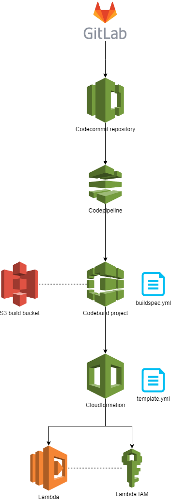

--> add images
--> review templates

# Lambda SAM pipeline with Gitlab 

This is a simple guide to setup a Lambda using the a SAM template with full CI/CD pipeline instructions.

It assumes an existing infrastructure with an existing API (using API gateway)

AWS CodeCommit push mirroring is currently the best way to connect GitLab repositories to AWS CodePipeline, as GitLab is not yet supported as one of their Source Code Management (SCM) providers.

## Overview



## Before we start

I highly recommend you setup a naming convention for your resources. AWS makes it particularly impractical to recognise the type of resources and the environments you are using if you don't include them in the name.
I also assume certain policies in terms of access, feel free to update them based on your requirements.

### Source
The source for each lambda function is its dedicated CodeCommit Repository.

The Pipeline is triggered on any new push to CodeCommit (which itself triggered by a push to the Gitlab repo).

Each Pipeline is specific to an object (Lambda Function, API, EC2, etc.). If a change to a the source CodeCommit repository is detected, the pipeline is triggered.

### Build & Deploy
You cannot use any AWS native feature with CodeDeploy to deploy code from CodeCommit to a Lambda function easily.

A workaround involves using CodeBuild and CloudFormation to deploy your code to the lambda function.

### Lambda & API Pipeline structure
The main source for the lambda functions is GitLab. 

For each Lambda function you should create : 

- One GitLab Repository
- One CodeCommit Mirror Repository
- One branch (master) - the same for both above repositories
- One Pipeline with the same execution role for all pipelines
- One S3 Build Bucket
- One buildspec.yml file
- One template.yml file

### Repo structure

I assume the following repository structure for your lambda:

```
.
├── src/
│   └── <code>
├── buildspec.yml
└── template.yml
```

All your code should be in a “src” folder.

### template.yml structure

I've included two templates in the docs folder, one for a Python runtime and one for Node.js runtime. Both have a very similar structure. 

The main body of the file will contain the resource you are looking to create, with a name properties (runtime, code path, memory size and timeout). You can also include environment variables. 

You can find information on environment variables from [the official AWS documentation](https://docs.aws.amazon.com/lambda/latest/dg/configuration-envvars.html).

Note: You cannot have an infinite number of variables, the total size of the environment variables cannot exceed 4KB. I have found that based on the length of the name of your variables, you can hold around 40 variables. 

### buildspec.yml structure

The buildspec file is quite simple and only contains a build phase. It simply packages the files onto S3 and then creates a stack (available in Cloudstack) with the declared resources.


## Step-by-step guide

- Create a new GitLab Repo
- Create 3 branches: master, staging, develop
- For each branch add the following protection:
  - master: default branch + allowed push and merge for maintainers only
  - staging: allowed push and merge for maintainers only
  - develop:  allowed push and merge for developers and maintainers

<details>
<summary> <b>Lambda layers</b> </summary>
If you lambda uses layers (i.e. python libraries), you’ll have to create them manually and add their ARN like in the template above. Follow this guide for creating layers: https://www.kipi.bi/post/creating-an-aws-lambda-layer  ( pip3 install -r requirements.txt -t  ./). MAKE SURE TO ZIP THE PYTHON FOLDER WITH ITS CONTENTS, NOT JUST THE CONTENTS AS INDICATED IN THE GUIDE. YES, THEY’RE IDIOTS… For layers above 50MB, upload it to avumilambdalayers bucket and upload it from s3. BEWARE: The total size of the 5 maximum layers is 250MB. 
</details>

<br/>

- Create a CodeCommit Repo
- Create an IAM user with CodeCommit access and HTTPS Git credentials for AWS CodeCommit
- Add the CodeCommit Repo ARN (navigate to settings) to the resources of IAM user for the this CodeCommit Mirror User.

- In GitLab, mirror the repo to the CodeCommit repo you’ve created above (see Gitlab/CodeCommit mirroring section below if it is your first time). If you are picky about security, you may want to use a new user for each repo but you can also use the same.

- Create the s3 bucket for the artifacts in the build phase
- Update the buildspec.yml to specify the correct bucket and correct stack name (stack name is the function name and the s3 bucket uri is the one above)
- Update the template.yml file with the correct names, uri, handler and runtime. Add the environment variables template available here

- Go to CodePipeline and create a pipeline with:
  - CodeCommit as source
  - Add the relevant IAM role. You can create one from scratch, using the CodePipeline UI. I have found that the base policies attached to that role aren't sufficient. You will need to enable that role to: manage the policies, tags, etc. of the lambda including parameters, layers and permissions. You will need to update it based on the resources you want to create. 
  - The specially created bucket
  - The correct codecommit repository and branch based on the environment
  - The correct build phase for the object. If you have never created one, I highly recommend you create during the CodePipeline process rather than before or after. This will ensure that you have the right permissions.
  - You can create a separate build role or use the same as the IAM role you created in 2.
  - No deploy phase
  - (optional) A notification, for example to a specific slack channel

</br>
<details>
<summary> <b>If you lambda is to be linked to an API on API Gateway</b> </summary>

- add the ARN of the lambda function to be called in the appropriate IAM role responsible for the invocation of the function by API Gateway 
- update the api.yml for each branch by adding the new path and lambda proxy link

Refer to the API SAM Template repo for further information.

</details>


## Gitlab/CodeCommit mirroring

[This official guide](https://docs.gitlab.com/ee/user/project/repository/mirror/push.html#set-up-a-push-mirror-from-gitlab-to-aws-codecommit) can be useful.

- Go to the CodeCommit Repository
- Open your new repository, in the upper-right corner, select Code > Clone HTTPS (not Clone HTTPS (GRC)).
- In GitLab, open the repository to be push-mirrored.
- Select Settings > Repository, and then expand Mirroring repositories.
- Fill in the Git repository URL field with the URL you copied in the second bullet point
- I have found that using the username and password placeholders in the Gitlab UI can sometimes cause errors, particularly if you are using a self-hosted version of Gitlab Community. To avoid this, you can simply copy and past the following in the URL field: ``https:://<username>:<password>[remaining git commit URL]

If you don't encounter issues with using the username and password fields, you can:
- For Authentication method, select Username and Password.
- For Username, enter the AWS special HTTPS Git user ID.
- For Password, enter the special IAM Git clone user ID password created earlier in AWS.

At this stage, you can choose whether you cant to "only mirror protected branches". I recommend you do, to prevent mirroring all branches and just keeping the main environment branches you need. If you decide to follow this advice, you will next need to[ protect the branches](https://docs.gitlab.com/ee/user/project/protected_branches.html).

- Finally, select "Mirror repository"

The first time you mirror the repository, it is likely that the UI will update but no action will be taken. Simply refresh the mirror link (below the form) and refresh until you see a success message.


Note: Mirroring multiple branches successively in the same repository can lead to some branches not getting updated. I have found that if you wait a minimum of 5 minutes (anything less and it won't work) and manually refresh the link again, all the branches will be updated.

## Future improvements

- IAM policy management is quite tricky and this method requires updating IAM roles for various resources during creation and update. I recommend you setup a script to handle all of this rather than create the resources manually. 
- Branch handling could be improved by using, for example, the name of the pipelines in the buildspec.yml file to handle creation/update of the resources